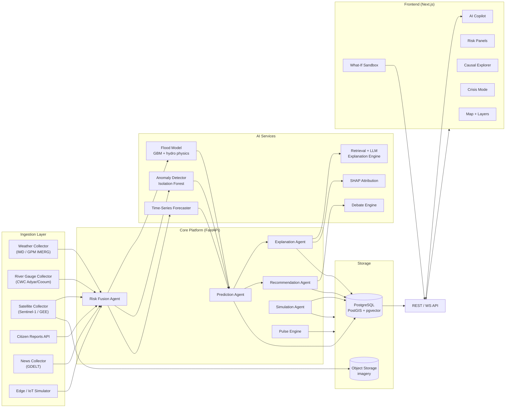

# EarthPulse AI — System Architecture

*Document 2/6. Covers deliverables 6–9: technical architecture, AI architecture, multi-agent architecture, data architecture (with schemas).*

---

## 1. Technical Architecture

### 1.1 Stack decisions

| Layer | Choice | Why |
|---|---|---|
| Frontend | Next.js 14 (App Router) + TypeScript + Tailwind + MapLibre GL | MapLibre is free (no API keys), tiles from OSM/Protomaps; Next gives server components + API routes; Tailwind for the dark mission-control design system |
| Charts | Recharts (time series) + D3 force layout (causal graph) | Proven, no-config |
| Backend | Python FastAPI + Pydantic + SQLAlchemy 2 | Fast to build, typed API contracts, async support for telemetry |
| Forecasting | StatsForecast (ETS/ARIMA/Prophet-style) + scikit-learn | Specialized statistical models — no LLM in the prediction path (principle #3) |
| Anomaly detection | Isolation Forest + 3σ on sensor streams | Interpretable, fast, no training data needed |
| Hydrology (simulation) | Deterministic curve-number / unit-hydrograph runoff model | Physically grounded, explainable, runs in milliseconds — right for V1 |
| LLM (explanation only) | GPT-4o / Gemini API via a single provider-agnostic gateway | Strictly scoped to explanation/reasoning/planning |
| Storage | PostgreSQL 16 + PostGIS + pgvector | One database for relational + geometry + embeddings |
| Object storage | Local filesystem / MinIO (S3-compatible) | Satellite frame imagery |
| Live updates | WebSocket via FastAPI | Real-time telemetry to dashboard |
| Observability | Structured JSON logs, `/metrics` (Prometheus), model registry + audit tables | Principles #1, #4 |
| Infra | Docker Compose (dev) → single-host deploy (demo) | Reproducible demo, zero cloud cost |

### 1.2 System diagram



### 1.3 Request flow (demo story)

```
Map loads → GET /risk/summary (all wards)
  → click ward → GET /risk/{ward_id} (score + confidence + features)
  → "why?" → GET /causal/{risk_id} (chain graph) + GET /explain/{risk_id} (SHAP + LLM narrative + citations)
  → "uncertain?" → POST /debate (two agents argue)
  → "what if?" → POST /simulate (intervention → before/after)
  → "so?" → GET /recommendations/{risk_id} (checklist + priority)
  → WebSocket /ws/live → telemetry ticks, crisis mode triggers
```

## 2. AI Architecture

### 2.1 Model assignments (specialized models — never LLM for raw prediction)

| Job | Model | Rationale |
|---|---|---|
| Flood risk prediction | Gradient-boosted classifier/regressor over engineered hydrologic features + lagged rainfall; calibrated probabilities (isotonic) | Interpretable (SHAP), trained on Chennai ward features; fast; no black box |
| Rainfall / river stage forecast | StatsForecast ETS/ARIMA on gauge + precipitation series (24/48/72h) | Classical, robust to small data, gives prediction intervals = honest uncertainty |
| Runoff propagation | Curve-number + unit-hydrograph model (deterministic) | Physical, explainable causal chain; turns rainfall forecast into stage/river flow forecast |
| Anomaly detection | Isolation Forest over multi-source streams | Flags unusual sensor/satellite/citizen patterns with interpretable scores |
| Explanation | LLM over retrieved evidence (RAG), grounded in model outputs + SHAP | LLM never *decides*; it *reports* what models + data said |
| Intervention simulation | Deterministic physics + heuristics with uncertainty sampling | Fast, reproducible, auditable |
| Debate | Two LLM personas with different priors over the same evidence bundle | Surfaces epistemic disagreement honestly when confidence is low |
| Recommendations | Rule-guided planner (priority = risk × exposure × time-to-impact), LLM writes the human checklist | Rules guarantee correctness; LLM provides prose |

### 2.2 Epistemic packaging

Every prediction object carries: `probability`, `severity`, `time_horizon_h`, `confidence_bounds` (from prediction intervals / calibration), `feature_attribution` (SHAP), `evidence[]` (source records), `limitations[]` (model-signed, e.g., "cloud cover reduces satellite certainty"), `model_version`.

### 2.3 Guardrails

- RAG corpus = only ingested trusted sources (IMD, CWC, NASA, official reports). No web search at inference time.
- LLM outputs must quote `evidence_id` fields; UI renders citations.
- If any input source is stale (>Xh), the fusion agent downgrades its weight and says so.

## 3. Multi-Agent Architecture

All agents are Python async workers with a shared message bus (Postgres-backed queue in V1; NATS later). Each agent publishes typed messages to a common `agent_messages` table; fusion subscribes.

| Agent | Mission | Inputs | Outputs | Memory | Confidence | Handoff | Failure mode |
|---|---|---|---|---|---|---|---|
| Weather Agent | Rain/storm telemetry | IMD, GPM IMERG | Rainfall series, forecast | Last 72h snapshots | Per-source staleness | → Fusion, Prediction | Degrade weight, mark "satellite" |
| River Gauge Agent | River stage/flow | CWC Adyar/Cooum | Stage+flow series, exceedance flags | Gauge history | Gauge health | → Fusion | Backfill from model, flag gap |
| Satellite Agent | Flood extent, land cover | Sentinel-1 (GEE) | Flood extents, NDWI anomalies | Recent frames | Cloud-cover-adjusted | → Fusion, Anomaly | Skip + note occlusion |
| Air Quality Agent | AQI telemetry | CPCB/CAMS | AQI series + anomaly flags | Baseline | Sensor uptime | → Fusion, Pulse | Mark stale |
| Water Monitoring Agent | Water quality | CPCB river stations | WQ series + flags | Baseline | Lab cadence | → Fusion | Mark stale |
| Citizen Report Agent | Ground truth reports | Report API | Normalized incident reports, geocoded | Report clusters | Cluster consensus | → Anomaly, Fusion | Dedupe, low-weight lone reports |
| News Intelligence Agent | Event context | GDELT RSS | Event signals + keywords | 7-day window | Source reliability | → Fusion, Recommendation | Ignore unverified |
| Risk Fusion Agent | Fuse into ward risk | All above | Fused feature vector + provenance graph | — | Source-weighted | → Prediction | Publish "incomplete coverage" state |
| Prediction Agent | Forecast + calibrate | Fused features | Risk predictions + bounds | Model registry | Calibration score | → Explanation, Pulse | Refuse low-data wards |
| Explanation Agent | Causal chain + narrative | Predictions, SHAP, RAG | Causal graph, SHAP pane, citations | — | Citation completeness | → UI, Debate | "Evidence insufficient" answer |
| Recommendation Agent | Action planning | Predictions, context | Checklist, priority, stakeholder briefs | Policy rules | Rule coverage | → UI, Simulation | Escalate to human |
| Simulation Agent | What-if engine | Intervention params | Before/after impact, damage, carbon | Run log | Model fidelity | → UI | Return error bounds |

**Debate Engine** is not a standing agent: it is an on-demand orchestration that instantiates two persona instances of the Explanation Agent (e.g., "conservative hydrologist" vs "statistical forecaster") over one evidence bundle, moderated by the fusion output.

## 4. Data Architecture

### 4.1 Schemas (PostgreSQL, key tables — abbreviated DDL)

```sql
CREATE TABLE locations (
  id           UUID PRIMARY KEY DEFAULT gen_random_uuid(),
  kind         TEXT NOT NULL,              -- 'ward' | 'region' | 'basin'
  name         TEXT NOT NULL,
  code         TEXT UNIQUE,                -- e.g. 'CHENNAI-W142'
  geometry     GEOMETRY(MULTIPOLYGON, 4326),
  exposure     JSONB NOT NULL DEFAULT '{}' -- population, assets, infrastructure
);

CREATE TABLE sources (
  id         UUID PRIMARY KEY DEFAULT gen_random_uuid(),
  provider   TEXT NOT NULL,                -- 'IMD' | 'CWC' | 'NASA-GPM' | 'ESA-S1' | 'CITIZEN' | 'GDELT'
  url        TEXT,
  license    TEXT,
  fetched_at TIMESTAMPTZ NOT NULL,
  raw_payload JSONB
);

CREATE TABLE weather_snapshots (
  id          UUID PRIMARY KEY DEFAULT gen_random_uuid(),
  location_id UUID REFERENCES locations(id),
  source_id   UUID REFERENCES sources(id),
  ts          TIMESTAMPTZ NOT NULL,
  precip_mm_1h REAL, precip_mm_24h REAL, temp_c REAL,
  wind_kmh REAL, humidity REAL,
  UNIQUE (location_id, ts, source_id)
);

CREATE TABLE satellite_frames (
  id          UUID PRIMARY KEY DEFAULT gen_random_uuid(),
  location_id UUID REFERENCES locations(id),
  source_id   UUID REFERENCES sources(id),
  ts          TIMESTAMPTZ NOT NULL,
  sensor      TEXT,                          -- 'SENTINEL-1' | 'SENTINEL-2'
  cloud_pct   REAL,
  image_path  TEXT,                          -- object storage key
  water_extent_ha REAL,
  anomaly_score REAL
);

CREATE TABLE events (                        -- modeled events / detected anomalies
  id          UUID PRIMARY KEY DEFAULT gen_random_uuid(),
  location_id UUID REFERENCES locations(id),
  kind        TEXT NOT NULL,                 -- 'flood' | 'wildfire' | 'dumping'
  status      TEXT NOT NULL DEFAULT 'forming',-- forming|active|declining|cleared
  detected_at TIMESTAMPTZ NOT NULL,
  summary     JSONB
);

CREATE TABLE risk_predictions (
  id           UUID PRIMARY KEY DEFAULT gen_random_uuid(),
  event_id     UUID REFERENCES events(id),
  location_id  UUID REFERENCES locations(id),
  model_id     TEXT NOT NULL,                -- model version, e.g. 'flood-gbm-v3'
  generated_at TIMESTAMPTZ NOT NULL,
  horizon_h    INT NOT NULL,                 -- 24 | 48 | 72
  probability  REAL NOT NULL,
  severity     TEXT NOT NULL,                -- LOW|MEDIUM|HIGH|SEVERE
  confidence_lo REAL, confidence_hi REAL,
  feature_attribution JSONB,                 -- SHAP values keyed by feature
  limitations  JSONB,
  evidence_ids UUID[] NOT NULL DEFAULT '{}'  -- provenance links
);

CREATE TABLE evidence (
  id            UUID PRIMARY KEY DEFAULT gen_random_uuid(),
  prediction_id UUID REFERENCES risk_predictions(id),
  source_id     UUID REFERENCES sources(id),
  kind          TEXT NOT NULL,               -- 'measurement' | 'satellite' | 'report' | 'news' | 'model_input'
  description   TEXT,
  weight        REAL,
  payload       JSONB
);

CREATE TABLE alerts (
  id            UUID PRIMARY KEY DEFAULT gen_random_uuid(),
  prediction_id UUID REFERENCES risk_predictions(id),
  location_id   UUID REFERENCES locations(id),
  level         TEXT NOT NULL,               -- ADVISORY|WATCH|WARNING|CRITICAL
  priority      INT NOT NULL,
  sent_at       TIMESTAMPTZ NOT NULL,
  channels      TEXT[] NOT NULL DEFAULT '{}' -- dashboard|sms|email
);

CREATE TABLE interventions (
  id          UUID PRIMARY KEY DEFAULT gen_random_uuid(),
  kind        TEXT NOT NULL,                 -- 'pumps' | 'sandbags' | 'evacuation' | 'retrofit'
  name        TEXT NOT NULL,
  params      JSONB NOT NULL,                -- e.g. {"pump_capacity_m3h": 400, "count": 4}
  cost        REAL
);

CREATE TABLE simulation_runs (
  id            UUID PRIMARY KEY DEFAULT gen_random_uuid(),
  event_id      UUID REFERENCES events(id),
  location_id   UUID REFERENCES locations(id),
  scenario      TEXT NOT NULL,               -- 'baseline' | intervention id
  ran_at        TIMESTAMPTZ NOT NULL,
  model_id      TEXT NOT NULL,
  result        JSONB NOT NULL,              -- flooded_ha, affected_population, damage_$, carbon_avoided_t
  uncertainty   JSONB
);

CREATE TABLE agent_messages (
  id            UUID PRIMARY KEY DEFAULT gen_random_uuid(),
  agent         TEXT NOT NULL,
  role          TEXT NOT NULL,               -- input|output|handoff
  topic         TEXT,
  confidence    REAL,
  payload       JSONB,
  parent_id     UUID,                        -- debate threads / causal chains
  created_at    TIMESTAMPTZ NOT NULL DEFAULT now()
);

CREATE TABLE user_actions (
  id          UUID PRIMARY KEY DEFAULT gen_random_uuid(),
  user_id     TEXT NOT NULL,
  action      TEXT NOT NULL,                 -- viewed_risk|ran_simulation|approved_alert
  context     JSONB,
  created_at  TIMESTAMPTZ NOT NULL DEFAULT now()
);

CREATE TABLE pulse_scores (
  id            UUID PRIMARY KEY DEFAULT gen_random_uuid(),
  location_id   UUID REFERENCES locations(id),
  ts            TIMESTAMPTZ NOT NULL,
  score         INT NOT NULL,                -- 0-1000
  components    JSONB NOT NULL,              -- {"flood": 812, "wildfire": 990, "air": 445, "water": 620, "heat": 701}
  weights       JSONB NOT NULL,
  rationale     TEXT[]
);

CREATE TABLE model_registry (                -- observability: versioning
  model_id      TEXT PRIMARY KEY,
  kind          TEXT NOT NULL,
  metrics       JSONB,                       -- calibration, AUC, MAE
  trained_on    TIMESTAMPTZ,
  artifacts     TEXT,
  approved_by   TEXT
);

CREATE TABLE audit_log (
  id        BIGSERIAL PRIMARY KEY,
  actor     TEXT NOT NULL,
  action    TEXT NOT NULL,
  entity    TEXT,
  entity_id UUID,
  diff      JSONB,
  at        TIMESTAMPTZ NOT NULL DEFAULT now()
);
```

### 4.2 Sources and provenance rule

Every `risk_predictions` row carries `evidence_ids` — a hard referential contract. The API refuses to return a risk score whose evidence list is empty. Provenance depth = "score → evidence → raw source payload".

### 4.3 Public data sources (Chennai pilot)

| Signal | Source | Notes |
|---|---|---|
| Rainfall | IMD gridded + GPM IMERG (NASA) | 0.1° resolution, near-real-time |
| River stage/flow | CWC gauge (Adyar, Cooum) | Historical + real-time where available |
| Flood extent | Sentinel-1 SAR via GEE | Flood-aware post-processing; cloud-occluded fallback |
| Elevation/terrain | SRTM DEM | Hydrologic routing, ward wetness index |
| Water bodies | OSM / HydroSHEDS | Drainage network |
| Ward boundaries | Chennai Corporation open data | Geometry + population |
| Air quality | CPCB / CAMS | Pulse score component |
| News | GDELT | Context signals |
| Citizen reports | In-app reports | Weighted by cluster consensus |

**Fallback policy:** the repo ships a `data/scripts/` synthetic-data generator so the demo never dies on an API outage — generated data is visibly tagged `SYNTHETIC` and excluded from evidence weighting in "live" mode.

### 4.4 Object storage

`satellite_frames.image_path` → MinIO/local `data/raw/imagery/`. Serving via signed URLs only.

---

*Next: docs/03-api-spec.md*
